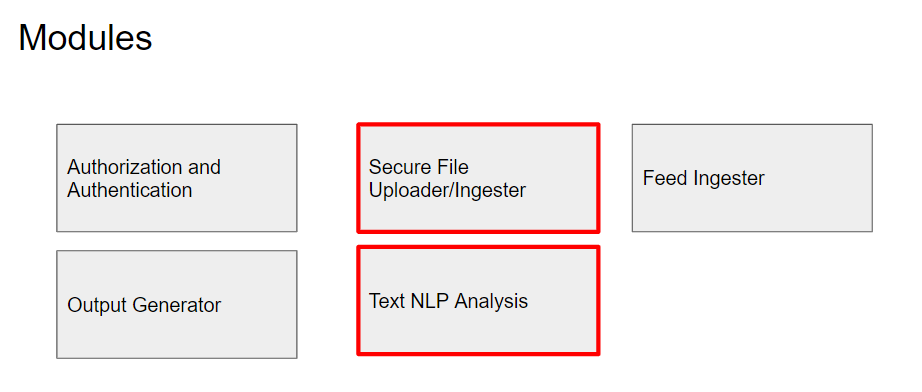

# SmartDocAnalyzer

### Activate virtual envrionment
- Type into root directory
`.\smartDoc\Scripts\activate`

### API Routes
`/users`
- Get all the users in the collection

`/user`
- Create a user

`/user/<username> ["GET"]`
- Get information about specific user

`/user/<username> ["DELETE"]`
- Delete infromation about a specific user

`/user/<username>/upload`
- Upload a file 

`/documents`
- Get all documents in the collection

`/user/<username>/documents`
- Get all the documents from a specific user

`/document/<filename>`
- Get file by filename 

### Activate virtual envrionment
- Type into root directory
`.\smartDoc\Scripts\activate`

### Text summary and NLP
- Both openai and google nlp are giving me issues

### Guidelines
- I should login to a secure service to upload my content
- I should be able to upload documents
- I should be able to upload PDFs or images.  The application should translate my documents to text
- I want the service to tag all my documents and paragraphs within every document with the keywords and know the topics each document cover
- I should be able to access different paragraphs of different documents based on keywords
- I should be able to to find all positive, neutral and negative paragraphs and sentences- 
- Keywords within paragraphs should be searchable in government opendata, wikipedia and media organizations, e.g., NYTimes
- I should find definition of keywords using open services (e.g., OpenAI)
- I should be able to get summaries of each document
- I want to discover content from the WEB to enhance story
- I want to know all names, locations, institutions and address in my documents.
- I want to upload different types of files (CSV, DOC, etc.)

